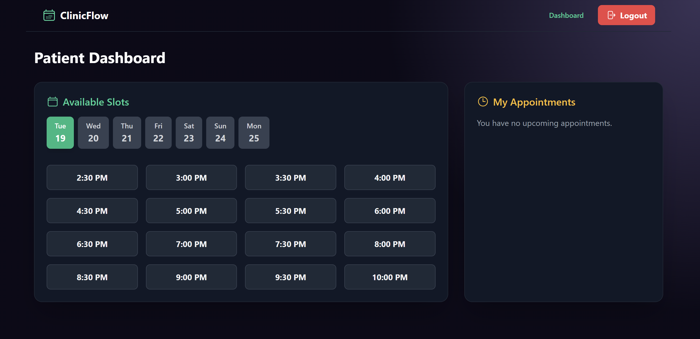

# ClinicFlow - Full-Stack Appointment Booking App



ClinicFlow is a modern, full-stack web application for booking medical appointments, built to exceed the requirements of a 4-hour take-home challenge. It features a sleek, dark aesthetic UI with a gradient-based design and fluid animations. The application allows patients to register, log in, view available slots, and manage their bookings, while an admin user can view all appointments across the clinic.

---

## 📋 Live Demo & Credentials

* **Frontend URL:** `https://appointment-bookingapp.netlify.app`
* **API URL:** `https://appointment-app-0jah.onrender.com`
* **Repo URL:** `https://github.com/Chaithanyaina/Appointment-App`

### **Test Credentials**
* **Patient:** `patient@example.com` / `Passw0rd!`
* **Admin:** `admin@example.com` / `Passw0rd!` (Seeded on server start)
---

## ✨ Features

* **Patient & Admin Authentication:** Secure JWT-based registration and login with role-based access control.
* **Dynamic Slot Viewing:** Patients can view available 30-minute slots for the next 7 days via an intuitive date selector.
* **Atomic Bookings:** A robust booking system that prevents double-booking at the database level using a unique index.
* **Appointment Management:** Patients can view their upcoming appointments and cancel them with a single click.
* **Admin Dashboard:** A comprehensive, searchable view for administrators to see all bookings in the system.
* **Aesthetic UI/UX:** A beautiful dark-mode interface with a custom gradient background and smooth animations via Framer Motion.
* **API Security:** The backend is protected with rate-limiting to prevent brute-force attacks.
* **Backend Testing:** Includes a suite of integration tests built with Jest and Supertest to verify core business logic.

---

## 🛠️ Tech Stack

* **Frontend:** React, Vite, Tailwind CSS, Framer Motion, Axios
* **Backend:** Node.js, Express.js, Mongoose, Jest, Supertest
* **Database:** MongoDB (via MongoDB Atlas)
* **Deployment:** Netlify (Frontend), Render (Backend)

### **Key Trade-offs**
* **NoSQL over SQL:** MongoDB was chosen for its schema flexibility and rapid development speed, ideal for this project's timeline. The trade-off is the lack of native support for complex transactions that a SQL database would provide.
* **Tailwind CSS over Component Library:** Tailwind CSS was used to create a bespoke, utility-first design. This allows for a unique aesthetic but can lead to more verbose JSX compared to using a pre-styled component library.

---

## 🚀 How to Run Locally

### **Prerequisites**
* Node.js (v18 or later)
* npm or yarn
* A free MongoDB Atlas account for the database connection string.

### **1. Clone the Repository**
```bash
git clone https://github.com/Chaithanyaina/Appointment-App
cd Appointment-App
```

### **2. Setup Backend (`/server`)**
```bash
cd server
npm install

# Create a .env file from the example
cp .env.example .env
```
Now, open the `.env` file and add your `DATABASE_URL` from MongoDB Atlas.

```env
# server/.env.example
DATABASE_URL="YOUR_MONGODB_CONNECTION_STRING"
JWT_SECRET="YOUR_SUPER_SECRET_KEY_FOR_JWT"
FRONTEND_URL="http://localhost:5173"

ADMIN_EMAIL="admin@example.com"
ADMIN_PASSWORD="Passw0rd!"
ADMIN_NAME="Admin User"
```

Start the backend server:
```bash
npm run dev
```
The backend will be running on `http://localhost:5000`.

### **3. Setup Frontend (`/client`)**
Open a new terminal window.
```bash
cd client
npm install
npm run dev
```
The frontend will be running on `http://localhost:5173`.

---

## 🏗️ Architecture & Design Decisions

* **Folder Structure:** A monorepo-style structure with distinct `client` and `server` directories for a clear separation of concerns.
* **Authentication:** JWT-based authentication with roles (`patient`, `admin`) embedded in the token. Backend middleware verifies the token and protects routes based on role.
* **Concurrency:** Double-booking is prevented using a **unique index** on the `slotStartTime` field in the MongoDB `bookings` collection. This makes the check an atomic database operation, which is the most reliable way to prevent race conditions.
* **Error Handling:** The backend returns consistent, structured JSON error messages. The frontend uses `react-hot-toast` to display these errors to the user in a non-disruptive way.

---

## 🌐 API Verification (cURL)

```bash
# 1. Register a new patient
curl -X POST http://localhost:5000/api/register \
-H "Content-Type: application/json" \
-d '{
  "name": "Test Patient",
  "email": "test-'"$(date +%s)"'@example.com",
  "password": "Password123"
}'

# 2. Log in and get a token (replace with the email you just registered)
TOKEN=$(curl -s -X POST http://localhost:5000/api/login \
-H "Content-Type: application/json" \
-d '{
  "email": "test-....@example.com",
  "password": "Password123"
}' | sed -n 's/.*"token":"\([^"]*\)".*/\1/p')

# 3. Book a slot (example slot ID)
SLOT_ID="2025-08-20T10:00:00.000Z"
curl -X POST http://localhost:5000/api/book \
-H "Content-Type: application/json" \
-H "Authorization: Bearer $TOKEN" \
-d "{\"slotId\": \"$SLOT_ID\"}"

# 4. Get "My Bookings"
curl -X GET http://localhost:5000/api/my-bookings \
-H "Authorization: Bearer $TOKEN"

# 5. Cancel a booking (get the booking ID from the previous command)
BOOKING_ID="[PASTE_BOOKING_ID_HERE]"
curl -X DELETE http://localhost:5000/api/bookings/$BOOKING_ID \
-H "Authorization: Bearer $TOKEN"
```